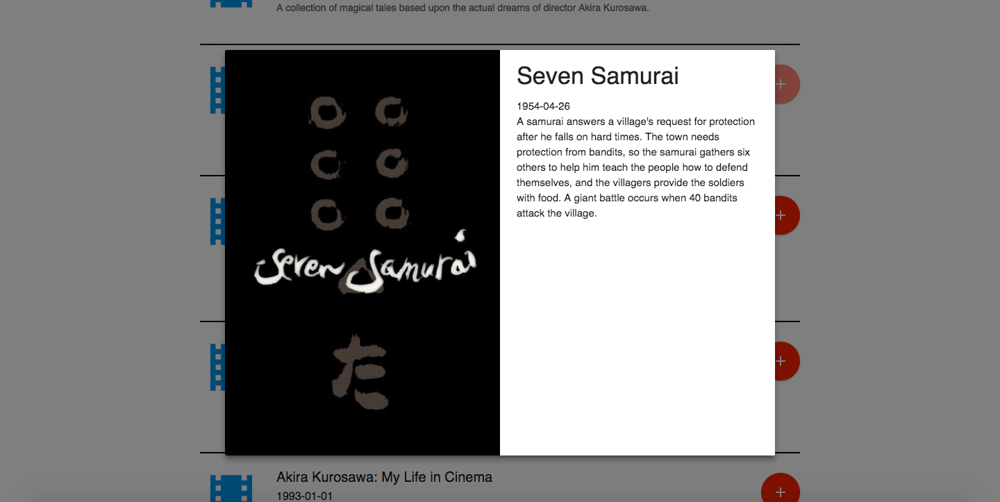
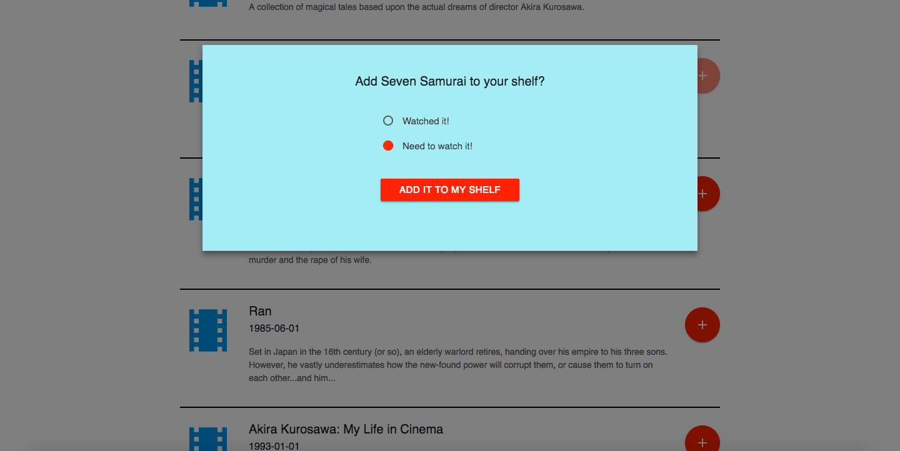
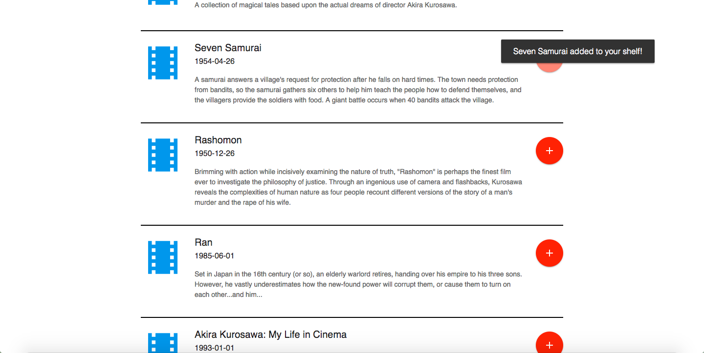
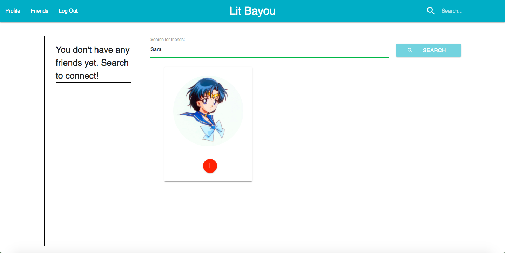
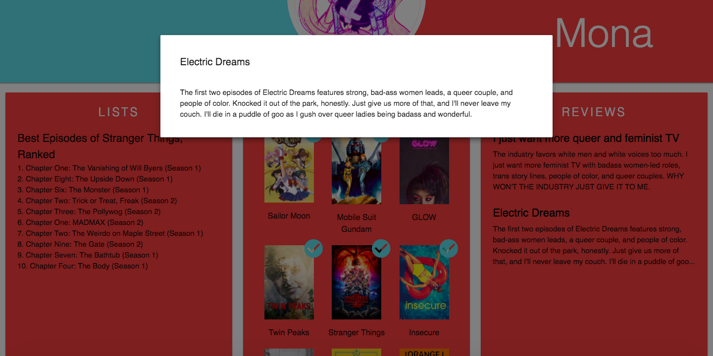

# Lit Bayou

***Lit Bayou*** is a social media app for movie and TV enthusiasts. 

## How does it work?
Anyone can use *Lit Bayou* to search for movies and television shows (powered by The Movie Database API). In order to get the most out of it though, you'll need to sign up and log in. From there you can add movies and shows to your shelf, write reviews, and make lists of your favorites. You can also add friends and see what they've been watching and enjoying/hating!

### Searching

Use the search bar in the upper right to find the media you're looking for. You can search by title, directors' name, actors' names, etc.

Click on the film or TV symbol to the left of search results for more information about that movie or show.

### Adding Media

You can add media to your shelf by clicking the round button with the plus sign next to the search result of your choice. You'll be prompted with a modal to choose whether you've watched the show/movie yet. 

### Making Friends

Click the Friends tab in the navbar to search for other registered users. 

Click the round button with the plus sign to add someone as a friend.

### User Profile Page

The user profile page is separated into three parts: lists, shelf, and reviews. 

Users can create any kind of list they want — Top 10, Favorites, Best Slasher Films, etc.

The shelf is for media that the user has seen or would like to watch. A blue check mark icon indicates that the user has watched that film or show before.

Users can also write reviews, which will show up on their profile page in truncated format. To view the entire review, you can click on the review title.

